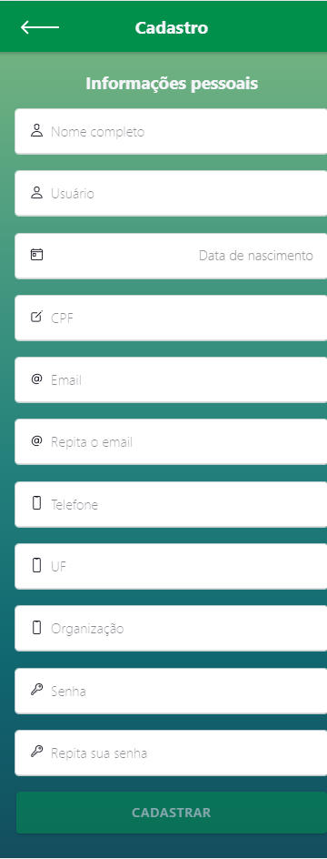
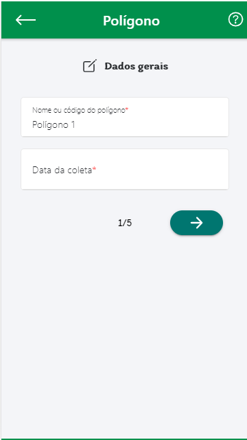
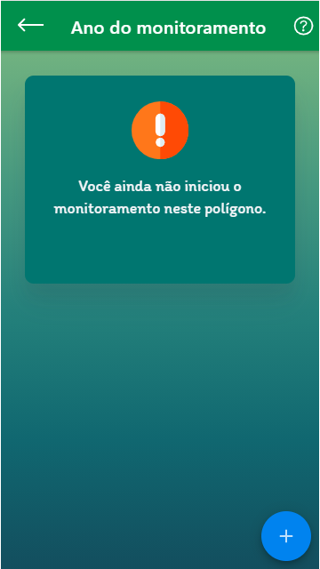
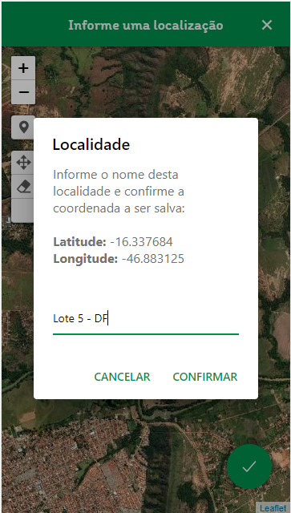

O protótipo é uma das etapas importantes dentro de um projeto de software, pois permite testar e validar o layout, a interação e o fluxo do usuário antes de partir para a implementação final. 

O desenvolvimento do protótipo do RADIS Cerrado foi criado utilizando o Figma, uma ferramenta de design colaborativo e prototipação que facilita a criação de interfaces interativas.

## Prototipação feito no Figma

Abaixo contém as principais telas do aplicativo RADIS Cerrado. O figma da prototipação pode ser acessado pelo seguinte link [Figma do CerradoTech](https://www.figma.com/design/wvjTdIIHYbomfCMfKE3F27/CerraTech-(REQ)?node-id=1103-205&t=4kv9bpXtuzZWR2pW-1)

### Tela de Login

---

### Tela de Cadastro

---

### Tela do Menu Principal

---

### Tela de cadastrar novo imóvel

---

### Tela de Imóveis cadastrados

---

### Tela detalhes do imóvel

---

### Tela meus polígonos

---

### Tela inical de cadastrar polígono

---

### Tela do polígono preenchido

---

### Tela de datalhes do polígono

---

### Tela de para iniciar um monitoramento sobre um polígono

---

### Tela de cadastrar monitoramento

---

### Tela cadastro de parcela 1

---

### Tela cadastro de parcela 2

---

### Tela cadastro de parcela 3

---

### Tela de catálogo de espécies cadastradas

---

### Tela de adicionar uma nova espécie

---

### Tela de mapas salvos

---

### Tela de registro de localidade

---

## Histórico de Revisão

| Data       | Versão | Descrição                                  | Autor            | Revisores        |
| ---------- | ------ | ------------------------------------------ | ---------------- | ---------------- |
| 07/02/2025 | 1.0    | Adicionando a prototipaçaõ ao gitpages | Brenno da Silva | Todos os Membros |