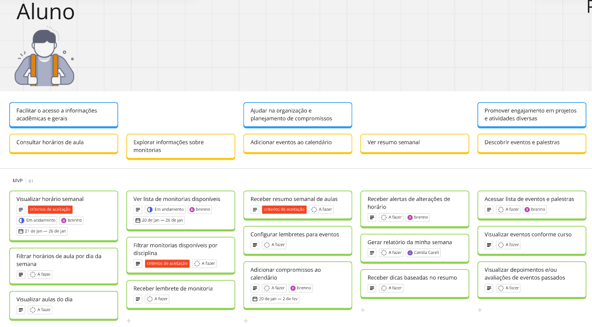
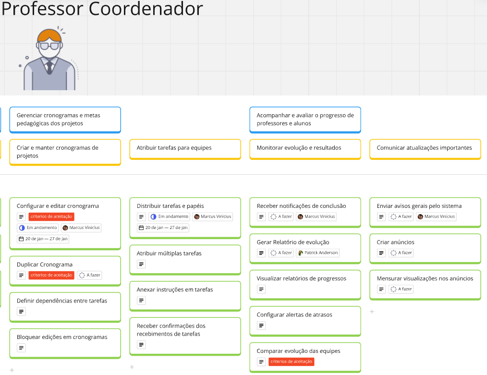
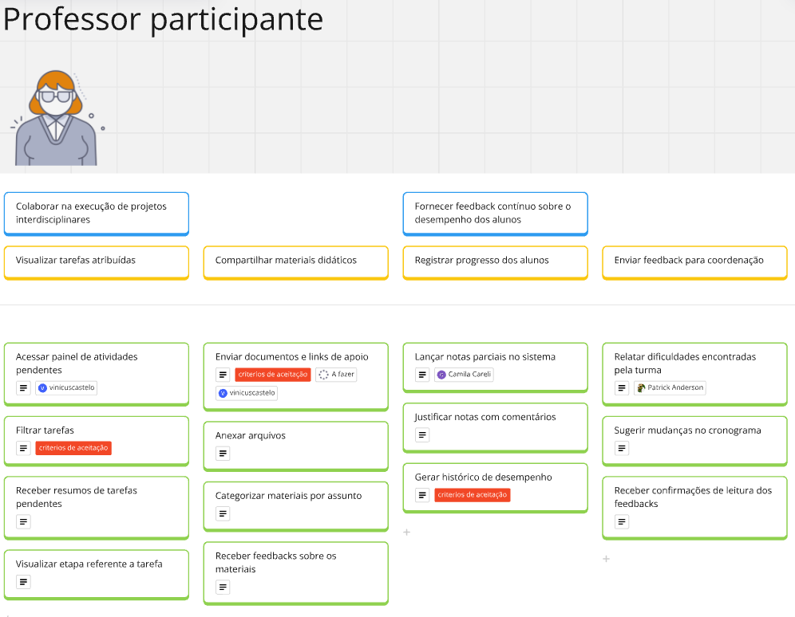
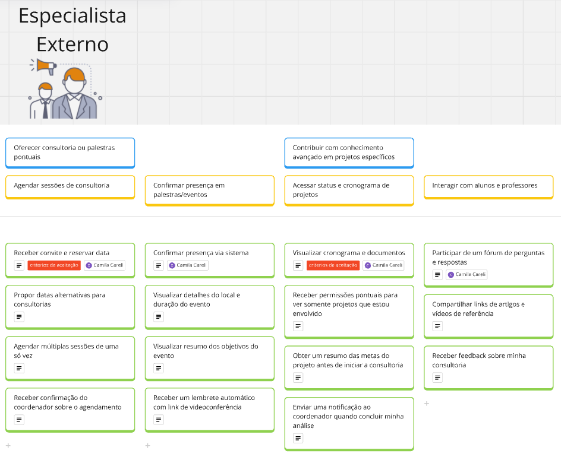
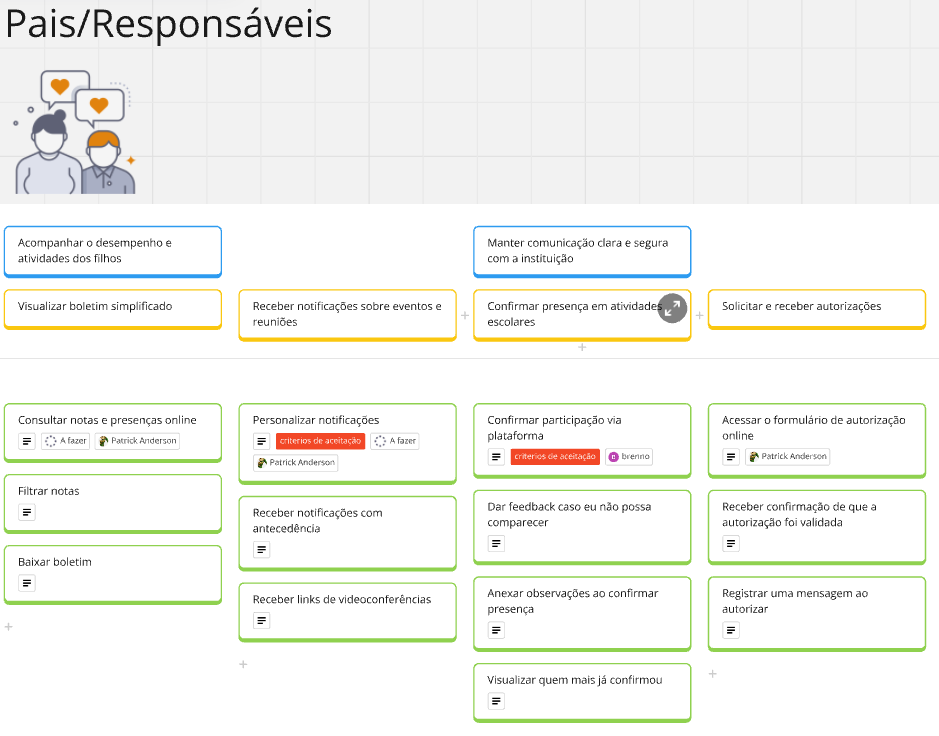
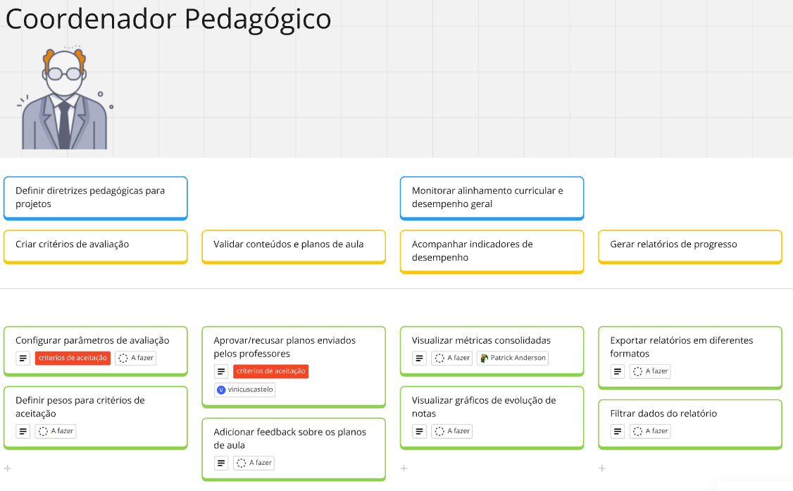

O USM (User Story Mapping) é uma técnica que organiza e prioriza funcionalidades com foco na experiência do usuário, promovendo alinhamento entre as equipes e stakeholders. Ele facilita a visualização do fluxo de atividades e garante que as entregas atendam às necessidades reais dos usuários. No projeto EduConnect, o USM é utilizado para estruturar histórias de usuário, planejando funcionalidades que conectem alunos, professores, pais e coordenadores de maneira eficiente.

## USM feito no MIRO

<iframe width="100%" height="600" src="https://miro.com/app/board/uXjVLrfusfg=/?share_link_id=766599514503" frameborder="0" scrolling="no" allow="fullscreen; clipboard-read; clipboard-write" allowfullscreen></iframe>

## Personas, Objetivos, Atividades e User Stories:

Estudo de caso feito sobre o produto **EduConnect**

**Objetivo do Produto:**
“Permitir que diferentes stakeholders (estudantes, professores e coordenação e etc) tenham acesso centralizado a informações acadêmicas, administrativas e extracurriculares, de forma a melhorar a organização, a colaboração e o engajamento com a instituição.”

### Persona 01

### Persona 02

### Persona 03

### Persona 04

### Persona 05

### Persona 06

## Histórias de Usuário que contém Critérios de Aceitação

---

**Atividade:** Visualizar horário semanal.

**História:** Como Aluno, quero visualizar meu horário semanal, para planejar minha rotina de estudos sem conflitos.

**Critérios de Aceitação:**

1. O sistema deve exibir o horário semanal do aluno em um formato de calendário com os dias da semana (segunda a domingo) e os horários das aulas organizados cronologicamente.
2. Caso haja sobreposição de horários entre as aulas ou atividades, o sistema deve destacar o conflito com uma indicação visual (como cor ou ícone) e exibir uma mensagem informativa sobre o conflito.

---

**Atividade:** Filtrar monitorias disponíveis por disciplina.

**História:** Como Aluno, quero filtrar as monitorias disponíveis por disciplina, para encontrar ajuda específica e otimizar meu tempo de estudo.

**Critérios de Aceitação:**

1. O sistema deve permitir a seleção de múltiplas disciplinas e intervalos de horário para refinar a busca.
2. Ao filtrar, devem ser exibidos apenas os horários de monitoria disponíveis, sem sobreposição com aulas existentes.

---

**Atividade:** Receber resumo semanal de aulas.

**História:** Como Aluno, quero receber um resumo semanal de aulas e prazos, para planejar minhas tarefas e atividades com antecedência.

**Critérios de Aceitação:**

1. O aluno deve ter a opção de configurar a frequência do resumo (diário, semanal ou desativado).
2. Caso não haja aulas ou prazos na semana, o sistema deve informar "Não há eventos programados para esta semana" no resumo.

---

**Atividade:** Configurar e editar cronograma

**História:** Como Professor Coordenador, quero configurar e editar cronogramas no sistema, para organizar os projetos de forma centralizada.

**Critérios de Aceitação:**

1. Deve ser possível adicionar, editar e remover tarefas, definindo datas de início e fim.
2. O sistema deve validar se há conflitos de datas ou sobreposições impraticáveis e avisar o usuário antes de salvar.

---

**Atividade:** Duplicar Cronograma.

**História:** Como Professor Coordenador, quero duplicar um cronograma existente, para agilizar a criação de novos projetos semelhantes.

**Critérios de Aceitação:**

1. Deve haver um botão ou comando “Duplicar” que copie todas as tarefas, prazos e dependências para um novo cronograma.
2. O sistema não deve copiar os usuários já atribuídos, permitindo que o coordenador faça novas atribuições.

---

**Atividade:** Comparar evolução das equipes.

**História:** Como Professor Coordenador, quero comparar a evolução de diferentes equipes lado a lado, para identificar boas práticas.

**Critérios de Aceitação:**

1. Deve haver uma visualização onde cada equipe apareça com um indicador de progresso (percentual ou gráfico).
2. O sistema deve permitir a seleção das equipes a serem comparadas e gerar um relatório consolidado em PDF ou exibir na tela.

---

**Atividade:** Filtrar tarefas.

**História:** Como Professor Participante, quero filtrar minhas tarefas por data de vencimento, para priorizar o que é mais urgente.

**Critérios de Aceitação:**

1. O sistema deve permitir visualizar tarefas organizadas por data de vencimento, com a opção de filtrar apenas as tarefas mais próximas do prazo.
2. O sistema deve destacar visualmente as tarefas com vencimento iminente (ex.: em até 3 dias) para facilitar a identificação de prioridades.

---

**Atividade:** Enviar documentos e links de apoio.

**História:** Como Professor Participante, quero enviar materiais de apoio, para auxiliar os alunos durante o projeto.

**Critérios de Aceitação:**

1. Deve ser possível anexar arquivos e incluir URLs, com confirmação de upload bem-sucedido.
2. Os alunos devem receber notificação automática de novo material disponibilizado.

---

**Atividade:** Gerar histórico de desempenho.

**História:** Como Professor Participante, quero gerar um histórico de desempenho por atividade, para analisar a evolução do aluno ao longo do projeto.

**Critérios de Aceitação:**

1. O sistema deve exibir o desempenho do aluno para cada atividade selecionada, com as métricas definidas (ex: notas, feedbacks, completude, etc.).
2. O professor deve poder exportar o histórico gerado em formato de relatório (PDF, Excel, Word.)

---

**Atividade:** Receber convite e reservar data.

**História:** Como Especialista Externo, quero receber convites e reservar uma data disponível, para garantir minha participação no evento.

**Critérios de Aceitação:**

1. O convite deve trazer no mínimo data, horário, tema do evento e link para confirmação.
2. Ao reservar a data, o especialista deve poder adicionar comentários ou restrições de horário.

---

**Atividade:**  Visualizar cronograma e documentos.

**História:** Como Especialista Externo, quero visualizar o cronograma e os documentos do evento, para me organizar e acessar todas as informações necessárias.

**Critérios de Aceitação:**

1. A visualização deve incluir as datas das etapas do projeto, objetivos e quaisquer anexos relevantes.
2. O acesso deve ser restrito aos projetos em que o especialista foi convidado ou designado, garantindo privacidade dos demais.

---

**Atividade:**  Personalizar notificações.

**História:** Como Pai/Responsável, quero personalizar os tipos de notificação que desejo receber, para evitar sobrecarga de mensagens.

**Critérios de Aceitação:**

1. O sistema deve permitir que o pai/responsável escolha os tipos de notificação que deseja receber (ex.: mensagens sobre eventos, desempenho escolar, ou comunicados gerais).
2. Após qualquer alteração, o sistema deve exibir uma confirmação visual de que as preferências foram atualizadas com sucesso.

---

**Atividade:**  Confirmar participação via plataforma.

**História:** Como Pai/Responsável, quero confirmar minha participação via plataforma, para assegurar minha presença no evento de forma rápida e eficiente.

**Critérios de Aceitação:**

1. O sistema deve permitir que o usuário acesse os detalhes do evento e tenha uma opção clara para confirmar sua participação.
2. O usuário deve receber uma notificação automática (e-mail ou mensagem no celular) confirmando sua participação no evento, incluindo detalhes como data, hora e local.

---

**Atividade:** Configurar parâmetros de avaliação.

**História:** Como Coordenador, quero configurar os parâmetros de avaliação, para personalizar os critérios e métodos de avaliação de acordo com as necessidades do curso.

**Critérios de Aceitação:**

1. Deve ser possível criar rubricas personalizadas com pesos para cada critério (ex: trabalho em equipe, criatividade).
2. As rubricas devem ser aplicadas aos projetos vinculados automaticamente, evitando configurações manuais repetitivas.

---

**Atividade:** Aprovar/recusar planos enviados pelos professores.

**História:** Como Coordenador, quero aprovar ou recusar planos enviados pelos professores, para garantir que os planos estejam alinhados com os objetivos do curso.

**Critérios de Aceitação:**

1. O sistema deve notificar o coordenador quando um novo plano de aula for submetido.
2. Ao aprovar ou recusar, o sistema envia feedback imediato ao professor, incluindo comentários adicionais.

---

## Histórico de Revisão

| Data       | Versão | Descrição                                  | Autor            | Revisores        |
| ---------- | ------ | ------------------------------------------ | ---------------- | ---------------- |
| 20/01/2025 | 1.0    | Primeiras Implementações e especificações. | Vinicius Castelo | Todos os Membros |
| 24/01/2025 | 2.0    | Adicionando USM ao GitPages | Brenno da Silva | Todos os Membros |