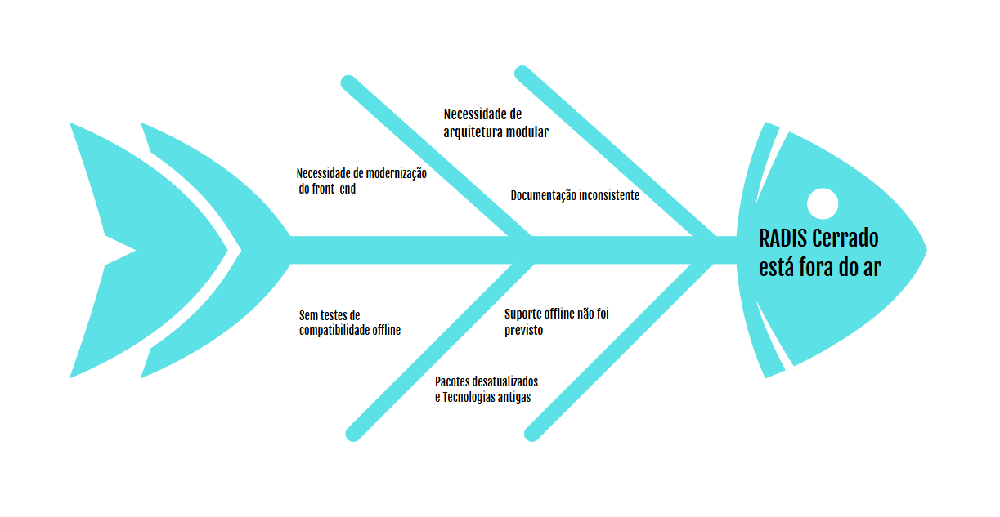

## Introdução ao Negócio e Contexto

O Centro de Gestão e Inovação da Agricultura Familiar (Cegafi), vinculado à Universidade de Brasília (UnB), é uma entidade de pesquisa dedicada ao desenvolvimento de soluções inovadoras para o setor agrícola familiar. Com um foco particular nas áreas de sustentabilidade e inclusão social, o Cegafi busca melhorar as condições de vida das populações rurais vulneráveis por meio de projetos que incentivam a preservação ambiental e promovem a segurança jurídica das propriedades. A instituição trabalha diretamente com pequenos proprietários e assentamentos, promovendo a recuperação de áreas que sofreram desmatamento para atividades agrícolas e assegurando que essas ações estejam em conformidade com a legislação ambiental brasileira.

Como parte desse compromisso, o aplicativo RADIS Cerrado foi desenvolvido para monitorar áreas degradadas do Cerrado, um dos biomas mais biodiversos e ameaçados do Brasil. Essa ferramenta oferece suporte técnico e científico, promovendo práticas de uso sustentável da terra que contribuem para a conservação do bioma e para a segurança alimentar das comunidades locais.

## Identificação da Oportunidade ou Problema

O RADIS Cerrado está atualmente fora do ar devido a uma série de problemas técnicos e operacionais que comprometem sua funcionalidade e expansão. As principais causas identificadas incluem:

- _Necessidade de Arquitetura Modular_: A falta de modularidade limita a escalabilidade e a adaptação do aplicativo a novas funcionalidades. Uma arquitetura modular é essencial para facilitar futuras integrações e a expansão do sistema, atendendo às demandas de parceiros e evoluções no monitoramento ambiental.
- _Necessidade de Modernização do Front-end_: O front-end utiliza pacotes desatualizados, comprometendo a usabilidade, segurança e compatibilidade com dispositivos modernos. A atualização para versões mais recentes do framework é crucial para proporcionar uma experiência de usuário aprimorada e garantir a manutenção de longo prazo.
- _Ausência de Testes de Compatibilidade Offline_: A operação offline é um requisito crítico para o uso do RADIS em áreas remotas, mas ainda não foi devidamente testada. A implementação e validação desse recurso são essenciais para permitir que dados sejam armazenados localmente e sincronizados posteriormente.
- _Falta de Documentação Consistente_: A ausência de uma documentação técnica clara dificulta a manutenção e a adaptação do sistema por novos desenvolvedores.
- _Pacotes Desatualizados e Tecnologias Antigas_: A utilização de tecnologias ultrapassadas limita a performance e a segurança do aplicativo, aumentando a complexidade de manutenção e atualização.

Esses desafios resultaram na indisponibilidade do aplicativo, impactando diretamente a capacidade do RADIS Cerrado de cumprir sua função de monitoramento ambiental. Contudo, a resolução desses problemas representa uma oportunidade para tornar o aplicativo uma ferramenta robusta e escalável, alinhada às necessidades dos stakeholders e ao objetivo de preservação ambiental do bioma Cerrado.

## Desafios do Projeto

- _Atualização da tecnologia do front-end_: O aplicativo foi desenvolvido em Ionic 5, uma versão desatualizada que dificulta a implementação de padrões modernos de usabilidade. A atualização dos pacotes e da estrutura do front-end é necessária para proporcionar uma experiência de usuário otimizada e manter o aplicativo alinhado com as melhores práticas atuais.
- _Garantia de funcionamento offline_: Para os usuários em áreas rurais e remotas do Cerrado, onde o acesso à internet é limitado ou inexistente, o suporte offline é essencial. Implementar essa funcionalidade é um desafio crítico para garantir que o aplicativo cumpra seu objetivo de monitoramento ambiental, independentemente das condições de conectividade.
- _Implementação de uma arquitetura modular_: A criação de uma arquitetura modular permitirá que o aplicativo seja facilmente expandido para atender a demandas futuras da ONG parceira e dos técnicos de campo. Essa abordagem trará maior flexibilidade ao projeto, tornando possível a adição de novos módulos sem a necessidade de uma reformulação completa.
- _Documentação abrangente do projeto_: A ausência de documentação técnica adequada tem sido uma barreira significativa para a manutenção e evolução do aplicativo. Desenvolver uma documentação clara e acessível é fundamental para facilitar futuras atualizações e corrigir problemas, especialmente considerando o histórico de insatisfação com o suporte e desenvolvimento anteriores.

## Segmentação de Clientes

- _Pequenos Agricultores_: Usam o aplicativo para monitorar a vegetação local e registrar dados de restauração de áreas degradadas, frequentemente em regiões com conectividade limitada.
- _Comunidades Rurais_: Similar aos pequenos agricultores, essas comunidades dependem do uso offline para coletar dados e garantir práticas sustentáveis.
- _ONGs_: Utilizam o aplicativo para acompanhar projetos de recuperação ambiental e prestar assistência técnica nas áreas rurais.
- _Técnicos Ambientais_: Coletam e processam dados de campo, colaborando com as ONGs e outros parceiros para acompanhar projetos ambientais.
- _Órgãos Reguladores_: O aplicativo fornece uma fonte confiável de dados que permite monitorar e avaliar o cumprimento de exigências ambientais, facilitando o trabalho de fiscalização e promovendo a preservação do Cerrado.

## Histórico de Revisão

| **Data**       | **Versão** | **Descrição**                                | **Autor**                    | **Revisores**               |
|-----------------|------------|----------------------------------------------|------------------------------|-----------------------------|
| 04/11/2024     | 1.0        | Primeiras Implementações e especificações.   | Vinicius Castelo             | Todos os Membros            |
| 11/11/2024     | 1.1        | Correções de parâmetros para apresentação.   | Vinicius Castelo             | Todos os Membros            |
| 18/11/2024     | 2.0        | Ajustes das Issues e informações adicionais  | Patrick Anderson Carvalho    | Todos os Membros            |
| 16/12/2024   | 2.1       | Nova organização e ajustes finais para U2      | Camila Careli                       | Todos os Membros            |